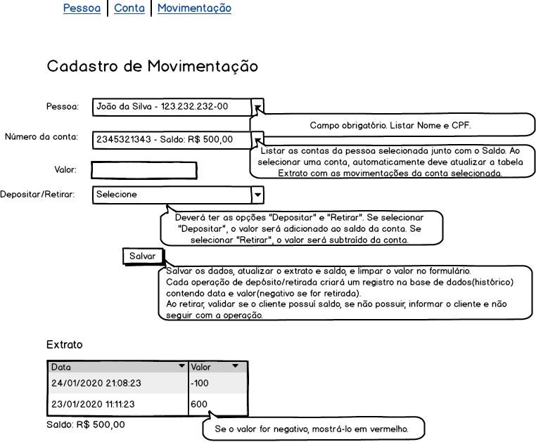

# Prova PHP IST

O desenvolvimento da prova consiste em desenvolver um sistema, conforme especificado nos protótipos abaixo.

**Cadastro de pessoa**

**Cadastro de conta**

**Cadastro de movimentação**

Para a realização da prova, deve-se utilizar a linguagem de programação **PHP**.

Alguns pontos em relação ao desenvolvimento:
- Pode ser utilizado qualquer framework PHP (Laravel, CodeIgniter, Symfony e outros) para o desenvolvimento.
- Fique a vontade para adicionar bibliotecas e ferramentas externas, caso ache necessário.
- O arquivo de exemplo de conexão com o banco de dados, está no arquivo `app/index.php`.
- Organize os arquivos do projeto de uma forma adequada (MVC).

## Configuração do Projeto

O projeto utiliza docker para criar um ambiente de desenvolvimento necessário, utilizando **PHP** e **MySql**.

Necessário instalar o docker: https://www.docker.com/get-started

O banco de dados `ist` com a tabela `pessoas` será criado automáticamente via docker, na hora que subir o projeto.
Mas cabe a você a estruturação e criação das demais tabelas, conforme modelado nos protótipos acima.
O script SQL de criação das demais tabelas necessárias para o projeto, deve ser adicionados no arquivo `db/ist.sql`.

Após o clone do projeto no **GitHub**, ir via terminal na pasta extraida e executar o comando do docker: `docker-compose up`.

**Atenção:** Se atentar que não pode haver nenhum serviço rodando nas portas `80` e `3306` no computador utilizado para a realização da prova, se tiver, será necessário fechar todos os serviços que utilizam essas portas.

Para verificar se a aplicação subiu corretamento com o docker, digitar no navegador http://localhost/, deverá mostrar uma tela inicial com **Hello World!**, e um exemplo de uma lista com os dados da tabela `pessoas`.

Abaixo os dados para testar a conexão com o banco de dados:
- host: localhost
- port: 3306
- database: ist
- user: root
- password: 123.456

**Atenção:** Ao publicar fique atento ao para mandar no repositorio compartilhado com você e não no pessoal.

No mais, desenvolva com qualidade e boa prova! :)
